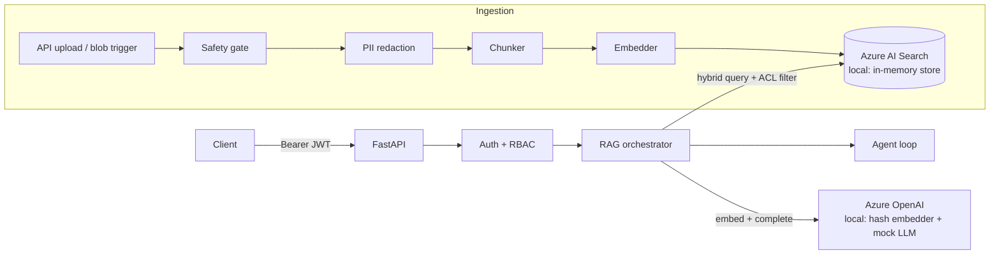

# KnowledgeForge

**An Azure-native enterprise knowledge platform: ingestion → hybrid retrieval → RAG chat, with document-level RBAC, PII redaction, and content safety built into the pipeline — and a credential-free local mode so the whole thing runs on your laptop.**

[](https://github.com/Rishabh-792/knowledgeforge/actions/workflows/ci.yml)


## Why this exists

Enterprise knowledge lives in a hundred places — wikis, policy PDFs, shared
drives, product docs — and most RAG demos ignore the part that actually makes
enterprise search hard: **not everyone is allowed to see everything**. This
repository is a reference implementation that treats security as part of the
retrieval pipeline, not an afterthought: ACL filtering happens inside the index
query, PII is redacted before anything is embedded, and a content-safety gate
fronts both ingestion and chat. It is not production infrastructure — the local
retrieval path is a documented linear scan and sessions are in-memory.

The second problem with reference implementations is that they demand a cloud
bill before they run. KnowledgeForge doesn't: every Azure dependency has a
functional local fallback behind the same interface, so `clone → install →
demo` works with zero credentials, and adding Azure keys flips the same code
paths onto Azure OpenAI and Azure AI Search.

## Features

- **Ingestion pipeline** — safety gate → PII redaction → recursive chunking
  with overlap → embeddings → index upsert, via API upload or a blob-triggered
  batch handler.
- **Hybrid retrieval** — vector similarity + keyword scoring merged into one
  ranked result set, with metadata (category) filters.
- **RAG chat** — grounded prompting with numbered citations and per-session
  history behind a swappable session store.
- **Agentic loop** — a tool-calling agent (retrieval + AST-safe calculator)
  with a max-iterations guard.
- **Document-level RBAC** — JWT roles (`reader`/`curator`/`admin`) gate
  endpoints; per-document ACL groups gate what search can even see.
- **PII redaction** — regex redactor locally, Azure AI Language in cloud mode.
- **Content safety** — keyword gate locally, Azure Content Safety in cloud mode.
- **Ops-ready** — structured JSON logs with request IDs, `/healthz`, Docker,
  Terraform for the full Azure footprint, CI/CD workflows.

## Architecture



Deep dive with sequence diagrams, data model, and scaling notes:
[docs/architecture.md](docs/architecture.md). Design decisions:
[docs/adr/](docs/adr/).

## Tech stack

| Layer | Technology |
|-------|-----------|
| API | FastAPI, pydantic v2, pydantic-settings |
| Auth | JWT (PyJWT), role hierarchy + ACL groups |
| Retrieval | Azure AI Search (hybrid) / in-memory cosine + keyword |
| Generation | Azure OpenAI / extractive mock LLM |
| Safety | Azure AI Language, Azure Content Safety / regex + keyword gates |
| Batch ingestion | Functions-style blob trigger, pypdf, python-docx |
| Infra | Terraform (azurerm), Docker, App Service, Key Vault, Log Analytics |
| CI/CD | GitHub Actions: ruff + pytest, container build → ACR → App Service |

## Quickstart (no cloud account needed)

```bash
git clone <this-repo> && cd knowledgeforge
pip install -r requirements-dev.txt
python scripts/demo.py
```

It seeds all 10 sample documents (51 chunks), then runs a hybrid search, a
grounded chat answer with citations, and an agent calculation. Shape of the
output:

```text
== KnowledgeForge demo (mode: local) ==

[1/4] Seeding sample documents...
  indexed <name>.md: <n> chunks, <n> PII redactions
  ... one line per document

[2/4] Hybrid search: 'how often is password rotation required?'
  <score>  it-security-policy #<chunk>
  ...

[3/4] RAG chat: 'What do I do if my laptop is stolen?'
  answer   : ... reported within four hours ...
  citations: [...]

[4/4] Agent: 'What is (14 + 90) * 2?'
  steps  : ['calculator']
  answer : (14 + 90) * 2 = 208
```

Then run the API (or `docker compose up`, which sets the same flag):

```bash
ALLOW_ANONYMOUS_DEV_ADMIN=true uvicorn app.main:app --reload
```

```bash
curl http://localhost:8000/healthz
# {"status":"ok","mode":"local","version":"1.0.0"}

curl -X POST http://localhost:8000/api/ingest/text \
  -H "Content-Type: application/json" \
  -d '{"title":"Password Policy","content":"Password rotation is required every ninety days for privileged accounts. Contact helpdesk@larkspur.example for lockouts.","category":"security","acl_groups":["public"]}'
# {"doc_id":"3f9c...","title":"Password Policy","chunks_indexed":1,"pii_redactions":1,"mode":"local"}

curl -X POST http://localhost:8000/api/chat \
  -H "Content-Type: application/json" \
  -d '{"message":"How often is password rotation required?"}'
# {"session_id":"...","answer":"Password rotation is required every ninety days for privileged accounts. ...","citations":[{"ref":1,"doc_id":"3f9c...","title":"Password Policy","score":0.53}], ...}
```

Anonymous access is **opt-in**: with `ALLOW_ANONYMOUS_DEV_ADMIN=true` (local
mode only — startup fails if it's combined with Azure credentials), tokenless
requests get a dev admin principal so the curl examples above just work.
Presented tokens are always verified — the RBAC tests mint real JWTs for
each role.

## Local mode vs Azure mode

The mode is **derived, not configured**: if the four `AZURE_OPENAI_*` /
`AZURE_SEARCH_*` values are set, the app runs in `azure` mode; otherwise
`local`. `/healthz` reports the active mode.

| Concern | Local (default) | Azure (keys in `.env`) |
|---------|-----------------|------------------------|
| Embeddings | Deterministic signed feature hashing | Azure OpenAI embedding deployment |
| Vector index | In-memory hybrid store | Azure AI Search (vector + BM25) |
| Chat | Extractive mock (answers only from retrieved chunks) | Azure OpenAI chat deployment |
| PII | Regex redactor | Azure AI Language |
| Content safety | Keyword gate | Azure Content Safety |
| Auth | JWT; anonymous dev admin (explicit opt-in) | JWT required, strong `JWT_SECRET` enforced |

The local fallbacks are functional, not stubs — the whole pipeline, including
every security control, executes end to end offline. Azure mode additionally
needs `pip install -r requirements-azure.txt`.

## Configuration

All settings load from the environment / `.env`
(see [.env.example](.env.example) for the full annotated list):

| Variable | Default | Purpose |
|----------|---------|---------|
| `JWT_SECRET` | random per process | HS256 signing key. Leave blank locally — a published constant would let anyone mint an admin token against any instance. A strong value is enforced at startup in azure mode |
| `ALLOW_ANONYMOUS_DEV_ADMIN` | `false` | Local quickstart only: tokenless requests act as dev admin; refused in azure mode |
| `CHUNK_SIZE` / `CHUNK_OVERLAP` | `800` / `150` | Chunker geometry (characters) |
| `RETRIEVAL_TOP_K` | `5` | Chunks fed to the LLM per question |
| `AGENT_MAX_ITERATIONS` | `4` | Hard stop for the agent loop |
| `AZURE_OPENAI_ENDPOINT` / `AZURE_OPENAI_API_KEY` | — | Enables Azure generation/embeddings |
| `AZURE_OPENAI_CHAT_DEPLOYMENT` / `AZURE_OPENAI_EMBEDDING_DEPLOYMENT` | `gpt-4o` / `text-embedding-3-large` | Deployment names |
| `AZURE_SEARCH_ENDPOINT` / `AZURE_SEARCH_API_KEY` / `AZURE_SEARCH_INDEX` | — / — / `knowledgeforge-chunks` | Enables Azure AI Search |
| `AZURE_LANGUAGE_*`, `AZURE_CONTENT_SAFETY_*` | — | Optional managed PII / safety services |
| `AZURE_STORAGE_CONNECTION_STRING` | — | Batch ingestion source container |

## Security model

- **Roles** gate endpoints: `reader` (search, chat) < `curator` (+ ingest)
  < `admin` (+ index management, ACL bypass).
- **ACL groups** gate documents: every chunk carries `acl_groups`; the
  visibility predicate runs *inside* the index query, so restricted content
  never reaches the app layer, the prompt, or the logs of an unauthorized
  caller — and `top_k` always means top-k *visible* results.
- **PII redaction** runs before chunking, so raw identifiers are never
  embedded or indexed.
- **Content safety** screens both inbound documents and chat messages, with a
  single failure mode (`422 ContentBlockedError`).
- **Agent calculator** evaluates arithmetic by walking a whitelisted AST —
  no `eval`, no builtins.

## Testing

```bash
pytest -q          # 37 tests, 80% line coverage, all offline
ruff check .       # lint
```

Coverage includes the chunker's edge cases, the RBAC visibility matrix, an
end-to-end local-mode RAG round trip (ingest → search → grounded answer →
citations), agent tool selection, calculator injection resistance, and API
smoke tests for every role boundary.

## Retrieval evaluation

Claiming a RAG system "works" without measuring retrieval is claiming nothing.
`evaluation/` holds a golden set of **30 questions over a 10-document,
51-chunk corpus**, each question answerable from exactly one document. Every
`answer_contains` string was checked to appear in its expected document and in
no other, so a hit cannot be scored by accident.

```bash
python -m evaluation.run_eval
```

Measured in local mode — no cloud account, no key, no network:

| Metric | Naive overlap | **BM25** |
|---|---:|---:|
| hit@1 | 0.367 | **0.533** |
| hit@3 | 0.500 | **0.700** |
| hit@5 | 0.700 | **0.767** |
| MRR | 0.474 | **0.621** |
| nDCG@5 | 0.535 | **0.657** |
| citation accuracy | 0.367 | **0.533** |

The **BM25 column is what the current code produces** — run the command above
and you should reproduce it exactly. The **naive-overlap column is historical**:
the harness and BM25 landed in the same commit, so the old scorer survives only
in git. To regenerate it:

```bash
git show 9fe7059:app/services/vector_store.py > /tmp/old_store.py  # pre-BM25
```

and run the harness against that file. Quoting a before/after where only the
"after" is reproducible would be the easy version of this table; the commit
reference is what makes the "before" checkable.

Full per-question results are committed to
[`evaluation/results.json`](evaluation/results.json), which also records
retrieve/answer latency. Latency is not quoted here on purpose — it swung
roughly 3x across runs on one machine, so it measures the laptop, not the
retriever. CI re-runs the evaluation and fails the build if the quality scores
drop below floors.

**The measurement paid for itself immediately.** The first run scored 0.70
hit@5 and 0.474 MRR. The lexical half of the hybrid was a raw query-token
overlap ratio: it ignored how rare a term is, how often it occurs in a chunk,
and how long the chunk is, so a long chunk mentioning a common word outranked
a short chunk that was actually about the query. Replacing it with Okapi BM25
(no new dependency, ~30 lines) lifted MRR by 31% (0.474 -> 0.621) and hit@3 by 40% (0.500 -> 0.700).

**Read these numbers for what they are.** They describe the *offline* stack:
signed-feature-hashing embeddings with no semantic capability, and an
extractive mock LLM. That is deliberately the weakest configuration the
project supports, and it is what CI can run with zero credentials. Azure mode
swaps in `text-embedding-3-large` and GPT-4o and would score differently — but
that has not been measured, so no number for it is claimed here. The low
`answer_groundedness` (0.167) is the mock LLM's extractive stitching, not a
retrieval failure: the right chunks are retrieved far more often than the
answer text reproduces the exact expected phrase.

## CI/CD

- **[ci.yml](.github/workflows/ci.yml)** — ruff + pytest on Python
  3.11/3.12/3.13 with coverage, a retrieval-evaluation gate, Terraform
  validation, and a container build with a health check. Runs entirely in
  local mode, zero secrets.
- **[deploy.yml](.github/workflows/deploy.yml)** — on version tags: build the
  container, push to Azure Container Registry, deploy to App Service, smoke
  check `/healthz`. *Reference pipeline: it describes the intended release
  path but has not been provisioned against a live subscription, so no
  deployment run exists in this repo's history.*
- **[infra/](infra/)** — Terraform for the full footprint: AI Search, OpenAI
  deployments, blob storage, Key Vault (secrets via references), Log
  Analytics + App Insights, and the App Service with managed-identity ACR
  pulls.

## Roadmap

- Qdrant adapter for the `VectorStore` protocol (compose profile already stubs
  the service).
- Native function calling for the agent in Azure mode.
- Cosmos DB / Redis session store implementations.
- Semantic reranker wired into the pipeline's rerank hook.
- Incremental connector framework (SharePoint-style change feeds) for the
  batch pipeline.

## License

[MIT](LICENSE).
