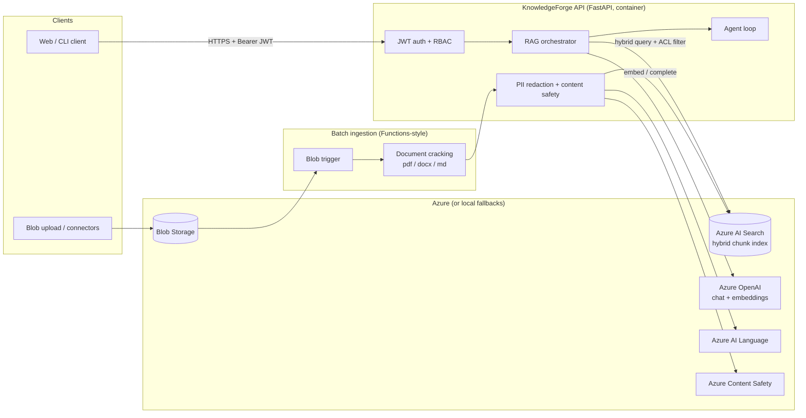
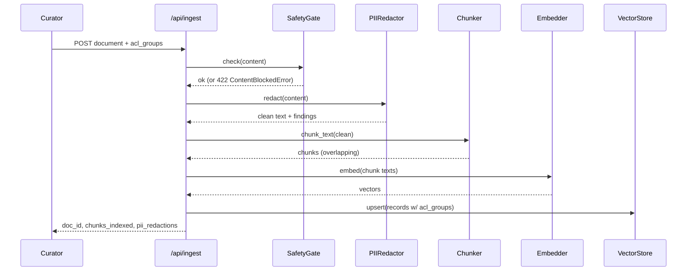
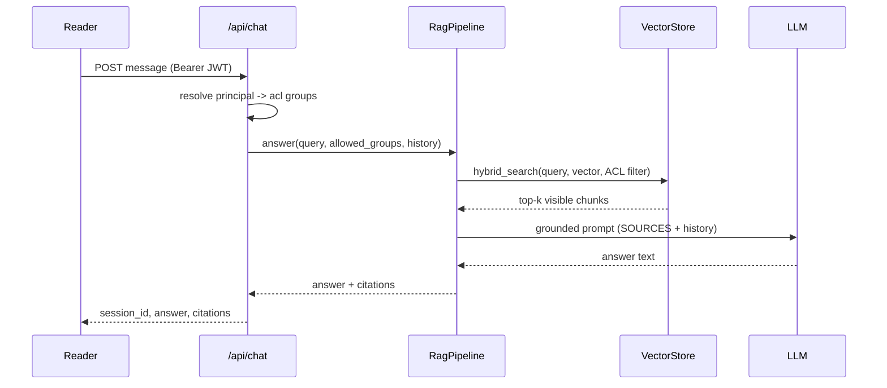

# KnowledgeForge Architecture

## Container view

In local mode the right-hand column is replaced in-process: `InMemoryStore`
for AI Search, `LocalHashEmbedder` + `MockLLM` for Azure OpenAI,
`RegexRedactor` for AI Language, and `KeywordGate` for Content Safety. The
orchestrator only depends on the Protocols, so the code path is identical.

## Ingestion sequence

## Chat sequence

## Data model

One flat chunk record is the unit of both indexing and authorization:

| Field | Type | Notes |
|-------|------|-------|
| `id` | string | `{doc_id}-{chunk_index}`, index key |
| `doc_id` | string | groups chunks back into documents |
| `title` | string | source document title |
| `category` | string | metadata filter (e.g. `policy`, `handbook`) |
| `chunk_index` | int | position within document |
| `content` | string | redacted chunk text |
| `content_vector` | float[] | embedding (named `vector` in code) |
| `acl_groups` | string[] | RBAC boundary; `public` is world-readable |

Chat sessions are a separate concern behind `SessionStore` (in-memory by
default; Cosmos DB or Redis in production).

## RBAC design

Two layers, deliberately independent:

1. **Role hierarchy** (`reader < curator < admin`) gates *endpoints*:
   readers search and chat, curators also ingest, admins also manage the index.
2. **ACL groups** gate *documents*: every chunk carries `acl_groups`; every
   search adds a visibility predicate (`public` or intersection with the
   caller's groups). Admins bypass the predicate (`allowed_groups=None`).

The filter is applied inside the store query (an OData filter in Azure AI
Search, a predicate in the in-memory scan) — never as post-processing — so a
leaked chunk can't even transit the application layer, and `top_k` semantics
stay correct.

## Scaling notes

- **API** is stateless (sessions behind an interface) — scale horizontally on
  App Service or any container platform; the in-memory store is explicitly a
  single-process dev convenience.
- **Azure AI Search**: add replicas for query throughput, partitions for index
  size; the index schema already separates the vector field so vector and BM25
  scale together.
- **Embedding throughput** is the ingestion bottleneck — batch requests and
  parallelize per-document; the batch pipeline is embarrassingly parallel per
  blob.
- **Cost control**: chunk size/overlap and `top_k` are configuration, and the
  rerank hook is the natural place to trade latency for quality.
- **Observability**: JSON logs carry `request_id`, path, status, and latency;
  in Azure they land in Log Analytics via App Insights.
